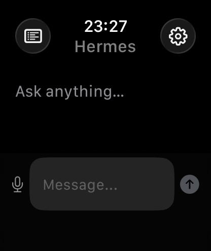

# WristHermes

把 Apple Watch 变成 Hermes Agent 的腕上终端——发 prompt、看回复。



## 架构

```
Apple Watch (SwiftUI) ← HTTP/Bonjour → Bridge Server (Node.js) → Hermes Web UI API
```

| 组件 | 技术 | 状态 |
|------|------|------|
| Bridge Server | Node.js 26+ / Express / Bonjour / TypeScript | ✅ 完成 + 测试通过 |
| watchOS App | SwiftUI / watchOS 10+ / Network.framework | ✅ 编译 + 模拟器运行 |

## 快速开始

### 1. 启动 Bridge

```bash
cd bridge
npm install        # 首次
npm run dev        # 启动开发模式，默认 localhost:3847
```

Bridge 自动读取 `~/.hermes-web-ui/profiles/default/.model-run-token` 认证 Hermes Web UI。

环境变量（可选）：
- `HERMES_URL` — Hermes Web UI 地址，默认 `http://localhost:8648`
- `HERMES_PROFILE` — 用的 profile，默认 `default`
- `PORT` — Bridge 监听端口，默认 `3847`
- `HERMES_API_KEY` — 手动指定 API key（优先级高于自动发现）

### 2. 构建 watchOS App

需要 macOS + Xcode 16+。

```bash
cd watch
xcodebuild -project WristHermes.xcodeproj -scheme WristHermes \
  -sdk watchsimulator -destination 'generic/platform=watchOS Simulator' build
```

或直接用 Xcode 打开 `watch/WristHermes.xcodeproj` → Run。

### 3. 测试

```bash
# Health
curl http://localhost:3847/health
# → {"ok":true,"hermesUrl":"http://localhost:8648","profile":"default"}

# Chat
curl -X POST http://localhost:3847/api/chat \
  -H "Content-Type: application/json" \
  -d '{"input":"Hello"}'
# → {"ok":true,"status":"completed","output":"Hi there!..."}

# Sessions
curl http://localhost:3847/api/sessions
# → [{"id":"...","title":"Hello","updated_at":"..."}]
```

## 项目结构

```
wristhermes/
├── bridge/                          # Node.js Bridge Server
│   ├── src/
│   │   ├── index.ts                 # Express 入口 + Bonjour
│   │   ├── hermes-api.ts            # Hermes Web UI API 客户端
│   │   └── types.ts                 # 共享类型
│   ├── package.json
│   └── tsconfig.json
├── watch/                           # watchOS App
│   ├── WristHermes.xcodeproj/
│   └── WristHermes/
│       ├── WristHermesApp.swift      # @main 入口
│       ├── Info.plist
│       ├── Models/
│       │   ├── Message.swift
│       │   └── Session.swift
│       ├── Services/
│       │   ├── BridgeClient.swift    # HTTP 客户端
│       │   ├── BonjourBrowser.swift  # mDNS 自动发现
│       │   └── SessionStore.swift    # 本地缓存
│       └── Views/
│           ├── ContentView.swift     # 主聊天界面
│           ├── MessageBubble.swift   # 消息气泡
│           ├── InputView.swift       # 输入框（文字+语音）
│           ├── SessionListView.swift # Session 列表/切换
│           └── SettingsView.swift    # 连接设置（手动 IP + Bonjour 扫描）
├── screenshot.png                   # App 截图
└── docs/plans/                      # 设计文档
```

## 测试结果

| # | 测试 | 结果 |
|---|------|------|
| 1 | Health check | ✅ |
| 2 | Chat 消息 | ✅ |
| 3 | Session 连续对话 | ✅ |
| 4 | Sessions 列表 | ✅ |
| 5 | 缺少 input → 400 | ✅ |
| 6 | 无效路径 → 404 | ✅ |
| 7 | 5x 连续请求 | ✅ (~3.9s/req) |
| 8 | watchOS 编译 | ✅ |
| 9 | watchOS 模拟器安装+启动 | ✅ |
|10 | Info.plist 配置 | ✅ |

## 后续规划

| 优先级 | 功能 |
|--------|------|
| P0 | watchOS App 真机部署到 Apple Watch |
| P1 | SSE 流式回复 |
| P1 | 语音听写深度集成 |
| P2 | 消息历史加载 |
| P2 | Quick Actions 快捷指令 |
| P3 | 多 Profile 切换 |
